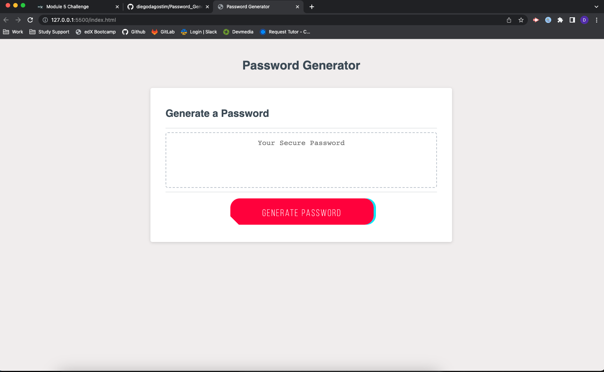

# Password_Generator

- On the first part of the code, we have defined the arrays.
- On the second part, I have defined the function to prompt user for password options
- Third part is the function to generate the password.
- Next step was the reference to the HTML file.
- The last step was the code to write the password inside the HTML structure.
- Finally, the code to listen to the button click.

